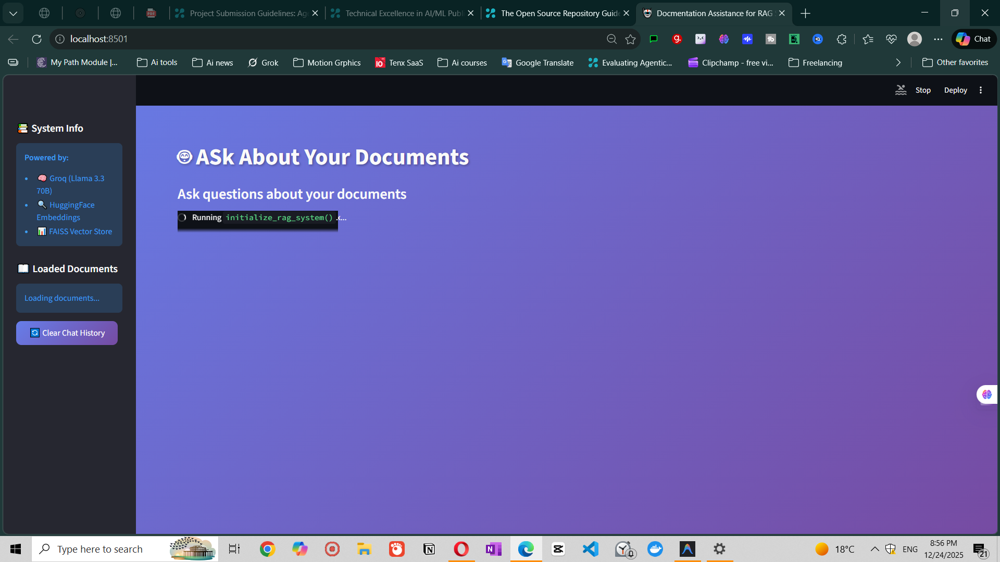

# Enterprise RAG System


A production-ready Retrieval-Augmented Generation (RAG) system with a beautiful web interface. Built with Groq, HuggingFace, and Streamlit for fast, accurate, and grounded question-answering from your documents.



## Overview

This Enterprise RAG System enables you to ask questions about your documents and receive accurate, grounded answers with full source attribution. The system strictly refuses to hallucinate - if the answer isn't in your documents, it will explicitly say "I don't know."

**Key Features:**
- 🎯 **Strict Grounding**: Answers only from provided documents, no hallucination
- 🚀 **Fast & Free**: Groq LLM + local HuggingFace embeddings
- 🎨 **Beautiful UI**: Modern Streamlit interface with chat history
- 📚 **Auto-Loading**: Automatically indexes all markdown files
- 🔍 **Source Attribution**: See exactly which documents were used
- ✅ **Production-Ready**: Comprehensive tests and evaluation framework

## Target Audience

This system is ideal for:
- **Developers** building document Q&A applications
- **Researchers** working with large document collections
- **Teams** needing internal knowledge bases
- **Anyone** wanting to understand RAG system implementation

## Prerequisites

- **Python**: 3.9 or higher
- **Groq API Key**: Free tier available at [console.groq.com](https://console.groq.com)
- **RAM**: 4GB minimum (for embeddings)
- **OS**: Windows, macOS, or Linux

## Installation

### 1. Clone the Repository
```bash
git clone https://github.com/yourusername/enterprise-rag-system.git
cd enterprise-rag-system
```

### 2. Create Virtual Environment
```bash
# Windows
python -m venv .venv
.venv\Scripts\activate

# macOS/Linux
python3 -m venv .venv
source .venv/bin/activate
```

### 3. Install Dependencies
```bash
pip install -r requirements.txt
```

### 4. Configure API Key
Create a `.env` file in the project root:
```
GROQ_API_KEY=your_groq_api_key_here
```

Get your free Groq API key from: https://console.groq.com/keys

## Usage

### Web Interface (Recommended)

Start the Streamlit app:
```bash
streamlit run app.py
```

The app will open in your browser at `http://localhost:8501`

**Features:**
- Chat-style interface
- View source documents for each answer
- Clear chat history
- See loaded documents in sidebar

### Command Line Interface

For programmatic access:
```bash
python src/main.py
```

### Example Queries

Try asking:
- "What is RAG and why is it important?"
- "How does chunking affect retrieval quality?"
- "What are the best practices for enterprise RAG systems?"
- "Who is the President of Mars?" (Should refuse: "I don't know")

## Adding Your Own Documents

1. Place markdown files in the `data/` folder
2. Restart the Streamlit app
3. The system automatically loads and indexes all `.md` files

**Supported formats:**
- Markdown (`.md`)
- Plain text (`.txt`) - via simple modification

## Project Structure

```
enterprise-rag-system/
├── app.py                 # Streamlit web interface
├── requirements.txt       # Python dependencies
├── .env                   # API keys (not in repo)
├── data/                  # Your documents (auto-loaded)
│   ├── *.md              # Markdown files
│   └── eval_set.json     # Evaluation dataset
├── src/                   # Core system
│   ├── ingestion.py      # Document loading & chunking
│   ├── vectorizer.py     # HuggingFace embeddings + FAISS
│   ├── retrieval.py      # Semantic search
│   ├── rag.py            # Groq LLM integration
│   ├── prompts.py        # System prompts
│   ├── main.py           # CLI interface
│   └── evaluate.py       # Evaluation script
└── tests/                 # Test suite
    └── test_*.py         # Unit & integration tests
```

## Configuration

### Environment Variables

| Variable | Description | Default |
|----------|-------------|---------|
| `GROQ_API_KEY` | Your Groq API key | Required |

### System Parameters

Edit these in the code:

**Retrieval (src/retrieval.py):**
```python
k=8  # Number of chunks to retrieve
```

**Chunking (app.py or src/main.py):**
```python
chunk_size=500      # Tokens per chunk
chunk_overlap=50    # Overlap between chunks
```

**Model (src/rag.py):**
```python
model_name="llama-3.3-70b-versatile"  # Groq model
```

## Testing

Run the test suite:
```bash
pytest tests/
```

Run with coverage:
```bash
pytest tests/ --cov=src
```

**Test Coverage:**
- Unit tests for all core components
- Integration tests for end-to-end pipeline
- Evaluation tests for answer quality

## Evaluation

Run the evaluation script:
```bash
python src/evaluate.py
```

This tests:
- Answer accuracy on specific questions
- Refusal accuracy (saying "I don't know" when appropriate)
- Source attribution quality

## How It Works

1. **Document Ingestion**: Loads markdown files, cleans text, splits into chunks
2. **Embedding**: Converts chunks to vectors using HuggingFace (local, free)
3. **Indexing**: Stores vectors in FAISS for fast similarity search
4. **Retrieval**: Finds top-k most relevant chunks for each query
5. **Generation**: Groq LLM generates answer using only retrieved context
6. **Attribution**: Returns answer with source documents

## Technology Stack

- **LLM**: Groq (Llama 3.3 70B Versatile)
- **Embeddings**: HuggingFace (sentence-transformers/all-MiniLM-L6-v2)
- **Vector Store**: FAISS
- **Framework**: LangChain
- **UI**: Streamlit
- **Testing**: Pytest

## Performance

- **Response Time**: 2-3 seconds per query
- **Retrieval**: 8 chunks per query
- **Embedding**: Local (no API calls)
- **Cost**: Free tier available (Groq)

## Troubleshooting

### "API key not valid"
- Check your `.env` file has `GROQ_API_KEY=your_key`
- Verify the key at https://console.groq.com/keys

### "No module named 'streamlit'"
- Activate virtual environment: `.venv\Scripts\activate`
- Install dependencies: `pip install -r requirements.txt`

### "No documents found"
- Ensure markdown files are in `data/` folder
- Check file extensions (`.md` or `,md`)
- Restart the Streamlit app

### Poor answer quality
- Increase retrieval chunks: Edit `k=8` to `k=12` in `src/retrieval.py`
- Adjust chunk size: Edit `chunk_size` in `app.py`
- Add more relevant documents to `data/`

## Contributing

Contributions are welcome! Please see [CONTRIBUTING.md](CONTRIBUTING.md) for guidelines.

1. Fork the repository
2. Create a feature branch
3. Make your changes
4. Add tests
5. Submit a pull request

## License

This project is licensed under the MIT License - see the [LICENSE](LICENSE) file for details.

## Acknowledgments

- Built with [LangChain](https://langchain.com)
- Powered by [Groq](https://groq.com)
- Embeddings by [HuggingFace](https://huggingface.co)
- UI by [Streamlit](https://streamlit.io)

## Contact

- **Issues**: [GitHub Issues](https://github.com/yourusername/enterprise-rag-system/issues)
- **Discussions**: [GitHub Discussions](https://github.com/yourusername/enterprise-rag-system/discussions)

---

**⭐ Star this repo if you find it helpful!**
